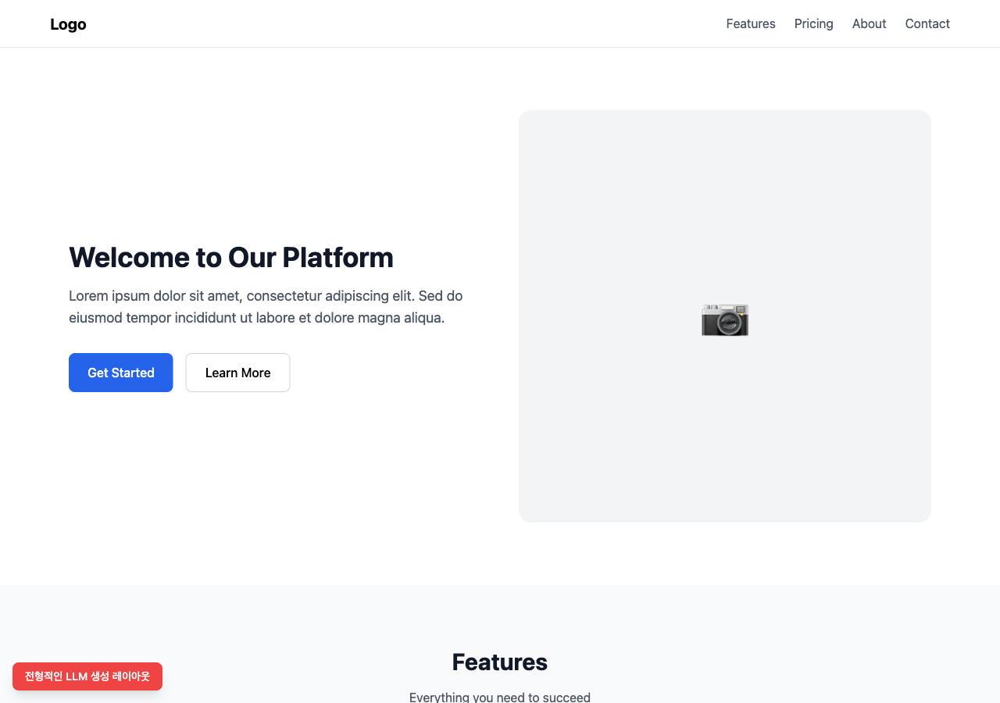
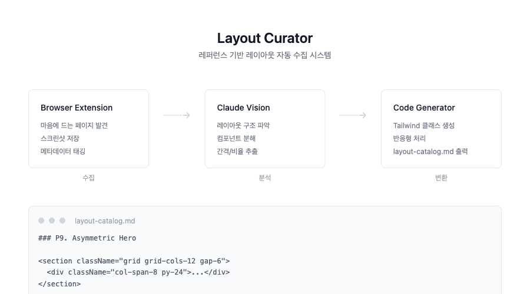

## 문제: LLM이 만든 레이아웃은 왜 다 비슷할까

Claude Code로 UI를 만들다 보면 이상한 점을 느끼게 된다. 분명 다른 프롬프트를 줬는데 결과물이 비슷비슷하다. Hero 섹션은 항상 왼쪽 텍스트 + 오른쪽 이미지, 카드 그리드는 3열 균등 배치, 통계 섹션은 숫자 4개 가로 나열.

틀린 건 아니다. 하지만 감각적이지 않다.



## Before: Layout Catalog v1의 한계

현재 디자인 시스템에는 `layout-catalog.md`라는 파일이 있다. Claude Code hooks를 통해 "레이아웃", "랜딩페이지" 같은 키워드가 감지되면 자동으로 주입되는 스킬 파일이다.

```json
{
  "matcher": "레이아웃|layout|페이지|page|섹션|section|랜딩|landing",
  "hooks": [{
    "type": "command",
    "command": "cat .claude/skills/layout-catalog.md"
  }]
}
```

987줄짜리 이 파일에는 8개의 페이지 레이아웃(P1~P8)과 10개의 섹션 레이아웃(S1~S10)이 Tailwind 코드로 정의되어 있다. Split Hero, Bento Grid, Timeline 등 나름 다양한 패턴이다.

문제는 이 레이아웃들도 결국 "머릿속으로 상상해서 만든" 것이라는 점이다. 실제로 잘 디자인된 사이트에서 검증된 패턴이 아니라 일반적인 패턴을 나열해놓은 것에 가깝다. 결과물이 기능적이긴 해도 감각적이지 않은 이유다.

## Journey: 레퍼런스 수집 시스템 구상

해결책은 단순하다. 잘 만들어진 사이트에서 레이아웃을 수집하면 된다.

처음 떠올린 방식은 URL을 수집하는 것이었다. 하지만 Claude의 `WebFetch` 도구는 HTML 텍스트만 가져올 수 있다. CSS가 어떻게 렌더링되는지, 실제 시각적 결과물이 어떤지는 알 수 없다.

반면 스크린샷은 다르다. Claude의 `Read` 도구로 이미지를 읽으면 실제 렌더링된 화면을 분석할 수 있다. 여백, 비율, 색상 대비, 타이포그래피 계층까지 모두 파악 가능하다.

| 방식 | 가져오는 정보 | 레이아웃 분석 |
|------|--------------|-------------|
| WebFetch (URL) | HTML/CSS 텍스트 | 불가능 |
| Read (이미지) | 시각적 렌더링 결과 | 가능 |

그래서 구상한 시스템은 이렇다:

1. **브라우저 확장 프로그램**: 맘에 드는 페이지 발견 시 스크린샷 저장
2. **CLI 도구**: 수집된 이미지를 Claude Vision으로 분석
3. **자동 변환**: 분석 결과를 Tailwind 코드로 변환
4. **Catalog 업데이트**: `layout-catalog.md` 형식으로 export



## 범용 도구로 분리하기

처음에는 현재 디자인 시스템 레포에 이 기능을 추가하려 했다. 하지만 생각해보니 "LLM이 밋밋한 레이아웃을 만든다"는 문제는 이 프로젝트만의 문제가 아니다. Claude Code를 쓰는 모든 개발자가 겪는 보편적인 문제다.

그래서 별도 레포로 분리하기로 했다. `layout-curator` 같은 이름으로 독립 프로젝트를 만들고, 디자인 시스템은 그 결과물만 import하는 구조다.

```
layout-curator/
├── extension/        # 브라우저 확장 (스크린샷 수집)
├── cli/             # 분석 및 변환 CLI
├── references/      # 수집된 스크린샷
├── catalog/         # 생성된 layout-catalog.md
└── templates/       # 출력 포맷 템플릿
```

## 마무리

아직 구현 전이지만, 방향은 명확해졌다:

1. LLM이 만드는 레이아웃이 밋밋한 이유는 "검증된 레퍼런스 부족"
2. 이미지 분석을 통해 실제 디자인에서 패턴을 추출할 수 있다
3. 이 문제는 보편적이므로 범용 도구로 만드는 게 낫다

결국 AI가 좋은 결과물을 내려면 좋은 레퍼런스가 필요하다. 사람이 그렇듯이.
